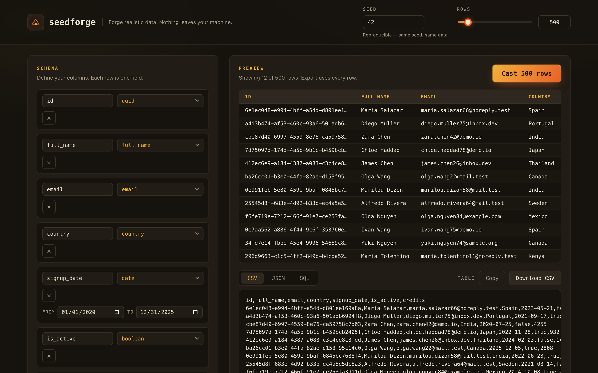

# seedforge

**Forge realistic fake data in your browser — reproducibly, and 100% offline.** Define a table schema, pick a seed, cast up to 5,000 rows, and export CSV, JSON, or SQL. Nothing you enter ever leaves your device.



## Why

Good fake-data tools are surprisingly hard to use for free. The best ones are ad-walled, rate-limited, or — worse — ask you to paste your real table schema into a form that POSTs it to someone else's server. Your schema is a description of your data model; it does not belong on a stranger's backend.

seedforge takes the opposite stance:

- **Private by construction.** Every byte is generated in your browser. A Content-Security-Policy of `connect-src 'none'` means the page *cannot* open a network connection even if it wanted to — the guarantee is enforced by the browser, not by a promise in a privacy policy.
- **Reproducible.** The generator is a deterministic PRNG seeded from your seed string. The same seed + schema + row count always produces byte-identical output. Share a seed with a teammate and you both get the exact same fixtures — perfect for tests, demos, and reviewable snapshots.

## Features

- **Reproducible seeded output** — cyrb53 hash → mulberry32 PRNG; deterministic to the byte
- **20+ field types** — uuid, names (mixed international + Filipino set), email/username derived from the row's name, phone, address, city, country, company, job title, integer, decimal, price, boolean, date, datetime, enum, lorem, ipv4, color hex, and clearly-fake credit-card patterns
- **Three export formats** — CSV (RFC-style quoting/escaping), pretty JSON, and multi-statement SQL `INSERT`s with a configurable table name
- **Correct escaping** — CSV quotes fields with commas/quotes/newlines and doubles embedded quotes; SQL doubles single quotes and emits `NULL` for empties
- **Live preview** — first 12 rows render instantly; export always uses the full set (1–5,000 rows)
- **Copy or download** — grab the active format to your clipboard or save it as a file
- **Persistent** — your schema, seed, and row count are saved to `localStorage`
- **100% offline** — no external fonts, scripts, images, analytics, or network calls of any kind

## Quickstart

Open `index.html` in any modern browser — or use the hosted version:

**→ [Try seedforge live](https://sreenivas-sadhu-prabhakara.github.io/seedforge/)**

No build step, no dependencies, no install. It is three static files (`index.html`, `styles.css`, `app.js`).

## Privacy

seedforge ships this header in the page:

```
Content-Security-Policy: default-src 'self'; connect-src 'none'; img-src 'self' data:; base-uri 'none'; form-action 'none'
```

`connect-src 'none'` blocks `fetch`, `XMLHttpRequest`, WebSockets, and `EventSource` at the browser level. There are no `<script src>` tags pointing anywhere but this repo, no web fonts, and no third-party assets. You can verify it yourself: open your browser's Network tab and watch it stay empty while you generate a million cells. Your schema and your data never travel.

## Disclaimer

All generated data is random and fictional. Any resemblance to real people, emails, addresses, or organizations is purely coincidental. Credit-card numbers are non-functional test patterns and are not valid for any transaction. seedforge is provided under the MIT License, 'as is', without warranty of any kind; the authors accept no liability for any use of this software or the data it generates.

## License

[MIT](./LICENSE) © 2026 Sreenivas Sadhu Prabhakara
